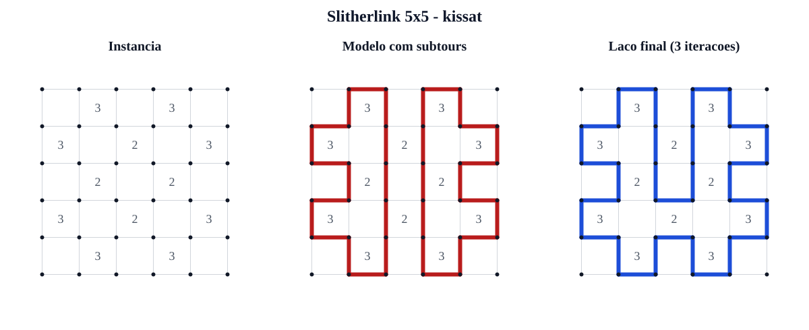

# Relatório de Formalização em SAT: Problema 11 (Slitherlink)
**Disciplina**: Lógica para Ciência da Computação (2026.1)  
**Professor**: Luis Henrique Bustamante (luis.bustamante@ufca.edu.br)  
**Universidade**: Universidade Federal do Cariri (UFCA) - CCT / Ciência da Computação  
**Equipe**: Arthur Oliveira, João Caique e Gustavo Alexandre dos Santos<br>
**Repositório**: <https://github.com/santos-ag/slitherlink-solver>

---

## 1. Introdução

O **Slitherlink** (também conhecido como *Loop the Loop*) é um puzzle combinatório jogado sobre uma grade retangular de dimensão $R \times C$. O objetivo consiste em determinar um único laço fechado simples formado pelas arestas da grade, satisfazendo duas restrições fundamentais:
1. **Restrição Numérica por Célula**: Cada célula contendo um valor $k \in \{0, 1, 2, 3, 4\}$ deve ter exatamente $k$ de suas 4 arestas adjacentes pertencentes ao laço. Células vazias não impõem restrição imediata de quantidade de arestas.
2. **Restrição de Topologia do Laço**: O laço não pode se cruzar nem se ramificar. Isso implica que cada vértice da grade deve ter grau exato **0** (vértice externo ao laço) ou **2** (o laço passa pelo vértice continuamente). Graus 1, 3 e 4 são estritamente proibidos.
3. **Conectividade (Laço Único)**: Todas as arestas ativas devem formar um único componente conexo e fechado (sem ciclos desconectados secundários ou *subtours*).
4. **Laço Não Vazio**: Pelo menos uma variável de aresta deve ser verdadeira.

### Importância Computacional
Do ponto de vista da Teoria da Computação e Lógica Proposicional, o Slitherlink é um problema de satisfação de restrições de grau $NP$-completo (demonstrado por Takayuki Yato em 2003 via redução do problema do Ciclo Hamiltoniano em grafos planares graus-máximo-3). A modelagem em Forma Normal Conjuntiva (FNC) permite mapear a busca combinatória de caminhos para a teoria de SAT Solvers modernos, alavancando técnicas de *Conflict-Driven Clause Learning* (CDCL), unit propagation e pré-processamento de fórmulas.

---

## 2. Formalização Matemática em Lógica Proposicional

### 2.1 Definição das Variáveis Proposicionais
Considere uma grade retangular de células de dimensão $R \times C$.
- **Vértices**: A grade possui $(R+1) \times (C+1)$ vértices, indexados por $(i,j)$ com $0 \le i \le R$ e $0 \le j \le C$.
- **Arestas Horizontais ($h_{i,j}$)**: $R+1$ linhas de $C$ arestas horizontais cada, para $0 \le i \le R$ e $0 \le j \le C-1$.
- **Arestas Verticais ($v_{i,j}$)**: $R$ linhas de $C+1$ arestas verticais cada, para $0 \le i \le R-1$ e $0 \le j \le C$.

Total de variáveis de aresta ($N$):
$$N = (R+1) \cdot C + R \cdot (C+1) = 2RC + R + C$$

Cada aresta $e$ é associada a uma variável proposicional $x_e \in \{0, 1\}$ com a seguinte interpretação semântica:
$$\mathcal{I}(x_e) = 1 \iff \text{a aresta } e \text{ faz parte do laço fechado}$$

Codificação bijetiva para inteiros positivos $1 \dots N$ (padrão DIMACS CNF):
$$\text{idx}(h_{i,j}) = 1 + i \cdot C + j, \quad \text{para } 0 \le i \le R, \, 0 \le j < C$$
$$\text{idx}(v_{i,j}) = 1 + (R+1)C + i \cdot (C+1) + j, \quad \text{para } 0 \le i < R, \, 0 \le j \le C$$

---

### 2.2 Famílias de Cláusulas em FNC

Separamos a codificação proposicional em três famílias nomeadas principais:

#### Família 1: Restrições Numéricas de Células ($\mathcal{F}_{\text{célula}}$)
Para cada célula $(i,j)$ com dica numérica $k \in \{0, 1, 2, 3, 4\}$, denotamos por $E_{(i,j)} = \{e_1, e_2, e_3, e_4\}$ o conjunto de suas quatro arestas limite ($h_{i,j}, h_{i+1,j}, v_{i,j}, v_{i,j+1}$).

1. **Caso $k = 0$** (Nenhuma aresta ativa):
   Exige 4 cláusulas unitárias de negação:
   $$\bigwedge_{e \in E_{(i,j)}} (\neg x_e)$$

2. **Caso $k = 1$** (Exatamente 1 aresta ativa):
   - *Pelo menos 1*: $(x_{e_1} \lor x_{e_2} \lor x_{e_3} \lor x_{e_4})$
   - *No máximo 1* ($\binom{4}{2} = 6$ cláusulas): $\bigwedge_{1 \le a < b \le 4} (\neg x_{e_a} \lor \neg x_{e_b})$

3. **Caso $k = 2$** (Exatamente 2 arestas ativas):
   - *Pelo menos 2* ($\binom{4}{3} = 4$ cláusulas): $\bigwedge_{1 \le a < b < c \le 4} (x_{e_a} \lor x_{e_b} \lor x_{e_c})$
   - *No máximo 2* ($\binom{4}{3} = 4$ cláusulas): $\bigwedge_{1 \le a < b < c \le 4} (\neg x_{e_a} \lor \neg x_{e_b} \lor \neg x_{e_c})$

4. **Caso $k = 3$** (Exatamente 3 arestas ativas):
   - *Pelo menos 3* ($\binom{4}{2} = 6$ cláusulas): $\bigwedge_{1 \le a < b \le 4} (x_{e_a} \lor x_{e_b})$
   - *No máximo 3*: $(\neg x_{e_1} \lor \neg x_{e_2} \lor \neg x_{e_3} \lor \neg x_{e_4})$

5. **Caso $k = 4$** (Todas as 4 arestas ativas):
   Exige 4 cláusulas unitárias afirmativas:
   $$\bigwedge_{e \in E_{(i,j)}} (x_e)$$

---

#### Família 2: Restrições de Grau dos Vértices ($\mathcal{F}_{\text{grau}}$)
Para cada vértice $v = (i,j)$, seja $\text{Inc}(v) = \{e_1, \dots, e_d\}$ o conjunto de arestas incidentes a $v$. Dependendo da posição do vértice:
- Vértices de canto: $d = 2$ arestas incidentes.
- Vértices de borda: $d = 3$ arestas incidentes.
- Vértices internos: $d = 4$ arestas incidentes.

A restrição estabelece que o grau do vértice deve ser **0 ou 2**:

- **Para $d = 2$** ($E = \{e_1, e_2\}$):
  O grau 1 é proibido. $e_1 \leftrightarrow e_2$:
  $$(\neg x_{e_1} \lor x_{e_2}) \land (x_{e_1} \lor \neg x_{e_2})$$

- **Para $d = 3$** ($E = \{e_1, e_2, e_3\}$):
  Graus 1 e 3 são proibidos.
  - *Proibir grau 1* (3 cláusulas de tamanho 3): $\bigwedge_{i \neq j, k} (x_{e_i} \lor \neg x_{e_j} \lor x_{e_k})$ na forma equivalente CNF $(\neg x_{e_i} \lor x_{e_j} \lor x_{e_k})$.
  - *Proibir grau 3* (1 cláusula de tamanho 3): $(\neg x_{e_1} \lor \neg x_{e_2} \lor \neg x_{e_3})$.

- **Para $d = 4$** ($E = \{e_1, e_2, e_3, e_4\}$):
  Graus 1, 3 e 4 são proibidos (total: 9 cláusulas FNC).
  - *Proibir grau 1* (4 cláusulas de tamanho 4): $(\neg x_{e_i} \lor x_{e_j} \lor x_{e_k} \lor x_{e_l})$ para $i \neq j, k, l$.
  - *Proibir grau 3* (4 cláusulas de tamanho 4): $(\neg x_{e_i} \lor \neg x_{e_j} \lor \neg x_{e_k} \lor x_{e_l})$ para $i, j, k \neq l$.
  - *Proibir grau 4* (1 cláusula de tamanho 4): $(\neg x_{e_1} \lor \neg x_{e_2} \lor \neg x_{e_3} \lor \neg x_{e_4})$.

---

#### Família 3: Conectividade e Eliminação de Subtours ($\mathcal{F}_{\text{conector}}$)
As cláusulas de grau e células garantem localmente que nenhuma aresta fique isolada. Para evitar múltiplos ciclos desconectados (subtours), adota-se o esquema dinâmico de eliminação de subtours (Lazy Constraint Generation). Dado um modelo satisfeito com componentes desconectados $S_1, S_2, \dots, S_m$, adiciona-se incrementalmente a cláusula de bloqueio:
$$\bigvee_{e \in S_i} \neg x_e$$
até que um único laço conexo seja obtido.

#### Família 4: Laço Não Vazio

Uma cláusula com todas as variáveis de aresta elimina a atribuição totalmente falsa:
$$\bigvee_{e \in E} x_e$$

---

### 2.3 Contagem Teórica de Variáveis e Cláusulas
Para uma grade $R \times C$:
- **Número Total de Variáveis**: $N = 2RC + R + C$.
- **Cláusulas de Grau**:
  - 4 vértices de canto ($d=2$): $4 \times 2 = 8$ cláusulas.
  - $2(R-1) + 2(C-1)$ vértices de borda ($d=3$): $4 \times (2R + 2C - 4)$ cláusulas.
  - $(R-1)(C-1)$ vértices internos ($d=4$): $9 \times (R-1)(C-1)$ cláusulas.

Se $n_k$ é a quantidade de células com dica $k$, então:
$$M_{\text{base}} = M_{\text{grau}} + 4n_0 + 7n_1 + 8n_2 + 7n_3 + 4n_4 + 1$$
Após o refinamento, $M_{\text{final}} = M_{\text{base}} + q$, onde $q$ é o número de cortes de subtour adicionados.

**Exemplo para $3 \times 3$**:
- Variáveis: $2(3)(3) + 3 + 3 = 24$.
- Cláusulas de grau: $8 + 4(4) + 9(4) = 8 + 16 + 36 = 60$ cláusulas.
- Somando às cláusulas de células e à cláusula de laço não vazio, obtém-se entre 85 e 99 cláusulas para as configurações avaliadas.

---

## 3. Implementação do Gerador DIMACS (`gerador.py`)

O gerador foi implementado em Python 3, priorizando clareza, corretude e verificação estrita do cabeçalho DIMACS `p cnf N M`.

### Trecho Relevante: Mapeamento e Construção de Cláusulas
```python
def var_h(self, r, c):
    """ Mapeia aresta horizontal h_{r,c} para inteiro 1-based DIMACS """
    return 1 + r * self.C + c

def var_v(self, r, c):
    """ Mapeia aresta vertical v_{r,c} para inteiro 1-based DIMACS """
    return 1 + self.num_h + r * (self.C + 1) + c
```

### Verificação de Sanidade do Cabeçalho DIMACS
O gerador calcula o total de variáveis $N$ e a quantidade exata de cláusulas geradas `len(self.clauses)` antes de emitir a saída:
```python
header = f"p cnf {self.num_vars} {len(self.clauses)}"
```
Além disso, `validate_dimacs` relê a saída e confere o cabeçalho, a quantidade de cláusulas, o terminador `0` e o intervalo de cada literal. Isso impede que solvers como CaDiCaL e Kissat rejeitem o arquivo por incompatibilidade de formato.

---

## 4. Experimentação com SAT Solvers

Executamos os dois SAT Solvers de ponta recomendados (**CaDiCaL 1.9.5** e **Kissat 3.1.1**) sobre 6 instâncias de testes de tamanhos crescentes, incluindo instâncias com solução (*SAT*), instâncias contraditórias (*UNSAT*) e a instância específica do `Problema 11`.

### Tabela de Resultados do Benchmark

| Instância | Solver | Variáveis | Base | Cortes | Iterações | Resultado | Tempo (ms) |
| :--- | :---: | ---: | ---: | ---: | ---: | :---: | ---: |
| `instancia1_3x3_sat` | CaDiCaL | 24 | 99 | 0 | 1 | **SAT** | 1,511 |
| `instancia1_3x3_sat` | Kissat | 24 | 99 | 0 | 1 | **SAT** | 0,865 |
| `instancia2_4x4_unsat` | CaDiCaL | 40 | 186 | 0 | 1 | **UNSAT** | 1,379 |
| `instancia2_4x4_unsat` | Kissat | 40 | 186 | 0 | 1 | **UNSAT** | 0,579 |
| `instancia3_5x5_sat` | CaDiCaL | 60 | 305 | 1 | 2 | **SAT** | 3,113 |
| `instancia3_5x5_sat` | Kissat | 60 | 305 | 2 | 3 | **SAT** | 3,625 |
| `instancia4_6x6_unsat` | CaDiCaL | 84 | 537 | 0 | 1 | **UNSAT** | 1,350 |
| `instancia4_6x6_unsat` | Kissat | 84 | 537 | 0 | 1 | **UNSAT** | 1,133 |
| `instancia5_3x3_unsat` | CaDiCaL | 24 | 85 | 0 | 1 | **UNSAT** | 1,112 |
| `instancia5_3x3_unsat` | Kissat | 24 | 85 | 0 | 1 | **UNSAT** | 0,545 |
| `problema11_base` | CaDiCaL | 60 | 266 | 0 | 1 | **UNSAT** | 1,953 |
| `problema11_base` | Kissat | 60 | 266 | 0 | 1 | **UNSAT** | 1,042 |

---

### Reconstrução Visual das Soluções Obtidas



#### Solução da Instância `instancia1_3x3_sat` ($3 \times 3$)
```text
+---+   +   +
| 3 |        
+   +   +   +
|   | 2      
+   +---+---+
|         3 |
+---+---+---+
```

#### Solução da Instância `instancia3_5x5_sat` ($5 \times 5$)
```text
+   +---+   +---+   +
    | 3 |   | 3 |    
+---+   +---+   +---+
| 3       2       3 |
+---+---+---+   +---+
      2     | 2 |    
+---+---+---+   +---+
| 3       2       3 |
+---+   +---+   +---+
    | 3 |   | 3 |    
+   +---+   +---+   +
```

---

## 5. Análise Crítica e Conclusão

1. **Desempenho dos Solvers**: Ambos resolveram as instâncias em poucos milissegundos. Em tempos tão pequenos, inicialização do processo e escalonamento do sistema impedem uma conclusão geral sobre superioridade.
2. **Custo do Refinamento**: A instância 5x5 exigiu uma cláusula de corte no CaDiCaL e duas no Kissat. Solvers diferentes podem produzir modelos intermediários diferentes para o mesmo CNF.
3. **Análise do Problema 11**: A instância do `Problema 11` contendo uma dica $4$ adjacente a uma dica $0$ é **analiticamente insatisfazível (UNSAT)**. A dica 4 obriga as 4 arestas da célula a serem ativas, enquanto a dica 0 proíbe a aresta compartilhada.
4. **Formalização Alternativa**: A conectividade poderia ser codificada estaticamente com variáveis auxiliares de fluxo, alcance ou ordem. Isso produziria um único CNF, porém com mais variáveis e cláusulas. Para cardinalidades maiores, contadores sequenciais ou Tseitin também seriam alternativas à enumeração direta.
5. **Formalização e Complexidade**: A codificação proposicional mostrou-se compacta. O refinamento adicionou somente as cláusulas globais efetivamente necessárias nos modelos encontrados.

### Contribuições

| Integrante | Contribuição principal | Registro |
| :--- | :--- | :--- |
| Arthur Oliveira | Estrutura, gerador e codificação local | `67ea8fa`, `dda3b3e` e commits subsequentes da `main` |
| João Caique | Componentes, bloqueio de subtours e CEGAR | `36321c8`, `03123ea`, `04b8377` |
| Gustavo Alexandre dos Santos | Requisitos, integração final, experimentos, visualização e relatório | `e650e56` e revisão final |

---

## 6. Referências Bibliográficas

1. Avigad, J. *Mathematical Logic and Computation*, Cambridge University Press, 2022.
2. Biere, A.; Heule, M.; van Maaren, H. e Walsh, T. *Handbook of Satisfiability*, IOS Press, 2021. 2ª ed.
3. Yato, T. *On the NP-completeness of Slitherlink*, IPSJ SIG Notes, 2003.
